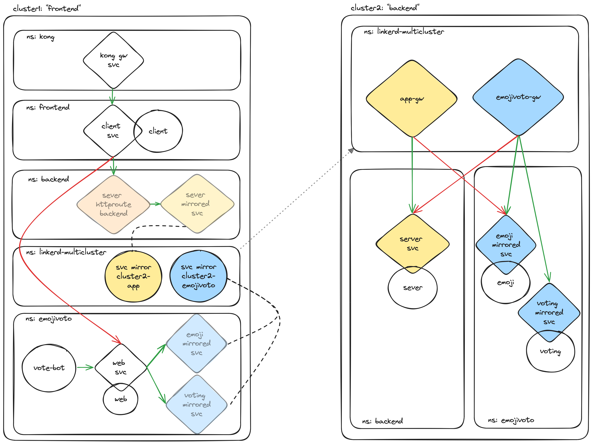

# Linkerd Multicluster Gateway Authentication Policy Examples

The resources and examples in this repository demonstrate how to configure Linkerd authentication policies in multicluster gateway mode. They show how to use gateway app groupings to ensure secure communication between services across clusters and enforce zero-trust segmentation.

## Overview

This repository showcases configurations for Linkerd multicluster gateways, focusing on granular authentication policies to prevent crossover communications between distinct application sets. The examples use two sets of applications:

- **App Set**: Includes a Kong ingress client, a frontend client, and a backend server.
- **Emojivoto Set**: Includes a frontend vote-bot and web service, as well as backend emoji and voting services.

The application sets are divided between two separate clusters, with Cluster1 containing the frontend application components of each, and Cluster2 containg the backend server components of each. 



Each application set has its own Linkerd multicluster gateway that communicates exclusively with its respective backend application set in Cluster 2, ensuring strict separation between application sets. This is indicated on the diagram above by color groupings. Auth policy enforcement is indicated by the green (Allowed) and red (Denied) arrows. Lastly, mirrored and shadow services (see more below for context) are shown with lowered opacity for easier visual parsing.

The examples in this repo also include configurations for routing rewrite rules, "empty" shadow services, Linkerd gateway CRDs, and service mirror cluster resources. For rewrite rules we employ the [HTTPRoute](https://linkerd.io/2.15/tasks/configuring-dynamic-request-routing/) object, though a [TrafficSplit](https://linkerd.io/2.15/tasks/multicluster/#traffic-splitting) resource could be used as well. the HTTPRoute rewrite rules allow us to showcase how traffic can be automatically and dynamically routed from one service to another without the client needing to be updated or have awareness of the underlying routing changes. This allows us to combine dynamic routing with multicluster for seemless failover between services, cross-cluster load balancing and blue/green deployments, and env-agnostic client routing. 

**Note**: Unlike TrafficSplits, HTTPRoutes require a parentRef service to exist in the cluster. For this reason, we've created "empty" service objects for all mirrored services used in this demo. Note that in actual production environments you will likely either have an existing service you can use to dynamically route, or have the ability to split the traffic at the Ingress or svc level using `hostname` match criteria instead. That being said, using an empty service is likewise valid.

## Directory Structure

The `multicluster-gateway-auth-policy` directory is organized as follows:

```
├── cluster1
│   ├── cluster1-app-httproute-rewrite.yaml
│   ├── cluster1-auth.yaml
│   ├── cluster1-client-deploy.yaml
│   ├── cluster1-emojivoto-deploy.yaml
│   ├── cluster1-emojivoto-httproute-rewrite.yaml
│   ├── cluster1-empty-httproute-svcs.yaml
│   ├── cluster1-kong-ingress.yaml
|   ├── deploy-cluster1-resources.yaml
│   └── multicluster-crds.yaml
└── cluster2
    ├── cluster2-app-servicemirror.yaml
    ├── cluster2-auth.yaml
    ├── cluster2-emojivoto-deploy.yaml
    ├── cluster2-emojivoto-servicemirror.yaml
    ├── cluster2-gateway-app-auth.yaml
    ├── cluster2-gateway-app-deploy.yaml
    ├── cluster2-gateway-emojivoto-auth.yaml
    ├── cluster2-gateway-emojivoto-deploy.yaml
    ├── cluster2-server-deploy.yaml
    ├── deploy-cluster2-resources.sh 
    └── multicluster-crds.yaml
```

## Prerequisites

- **Two or More Kubernetes Clusters**: Access to two or more Kubernetes clusters for deploying and testing the examples.
- **Linkerd Installed & Configured**: A BEL version of the Linkerd Control Plane installed and running.
- **Kong Installed & Configured**: A Kong controller installed and running, able to accept and create Ingress resources.
- **kubectl**: Installed and configured to interact with your Kubernetes clusters.

## Example

The following example uses only two uni-directional multicluster link objects to demonstrate the core concepts. In practice, it is possible to extend this example and add additional clusters or incorporate bi-directional multicluster link objects. For purposes of this example, we will start by configuring all components on Cluster 2 first and then pull this information dynamically with `linkerd multicluster link` later on to set up mirroring between the clusters.

### Cluster 2

- **`cluster2-multicluster-crds.yaml`**: Defines multicluster CRDs required for Linkerd.
- **`cluster2-gateway-app-auth.yaml`**: Sets up authentication policies for the "App" gateway.
- **`cluster2-gateway-app-deploy.yaml`**: Deploys the gateway application for the "App" set.
- **`cluster2-gateway-emojivoto-auth.yaml`**: Sets up authentication policies for the Emojivoto gateway.
- **`cluster2-gateway-emojivoto-deploy.yaml`**: Deploys the gateway application for the Emojivoto set.
- **`cluster2-server-deploy.yaml`**: Deploys the "App" application backend server components.
- **`cluster2-emojivoto-deploy.yaml`**: Deploys the Emojivoto application backedn components.
- **`cluster2-app-servicemirror.yaml`**: Configures service mirror RBAC and permissions for the "App" set.
- **`cluster2-emojivoto-servicemirror.yaml`**: Configures service mirror RBAC and permissions for the Emojivoto set.
- **`cluster2-auth.yaml`**: Defines granular and restrictive Linkerd authentication policies for the "App" and Emojivoto applications.


### Cluster 1

- **`cluster1-multicluster-crds.yaml`**: Defines multicluster CRDs required for Linkerd.
- **`cluster1-kong-ingress.yaml`**: Sets up Kong Ingress for routing within the cluster.
- **`cluster1-client-deploy.yaml`**: Deploys the frontend client application.
- **`cluster1-emojivoto-deploy.yaml`**: Deploys the Emojivoto application components.
- **`cluster1-backend-ns.yaml`**: Deploys the Backend namespace where the Cluster2 server will be mirrored.
- **`cluster1-empty-httproute-svcs.yaml`**: Creates empty shadow services for HTTPRoute rewrites.
- **`cluster1-app-httproute-rewrite.yaml`**: Configures HTTPRoute rewrite rules for the "App" set.
- **`cluster1-emojivoto-httproute-rewrite.yaml`**: Configures HTTPRoute rewrite rules for the Emojivoto set.
- **`cluster1-auth.yaml`**: Defines granular and restrictive Linkerd authentication policies for the "App"and Emojivoto applications.

To deploy these resources, run the following commands:

```bash
./deploy-cluster2.sh
./deploy-cluster1.sh
```

To create a one-directional link object from Cluster1 and Cluster2 with separate Service Mirrors and Gateways for each application set, run the following commands:

```bash
linkerd multicluster link --context cluster2 --cluster-name cluster2-app --gateway-name linkerd-gateway-app --service-account-name linkerd-gateway-app --namespace linkerd-multicluster --selector "mirror.linkerd.io/export-svcs=app" | kubectl --context cluster1 apply -f -

linkerd multicluster link --context cluster2 --cluster-name cluster2-emojivoto --gateway-name linkerd-gateway-emojivoto --service-account-name linkerd-gateway-emojivoto --namespace linkerd-multicluster --selector "mirror.linkerd.io/export-svcs=emojivoto" | kubectl --context cluster1 apply -f -
```

**Note**: You can change the selector that each application set's service mirror will watch if necessary to fit your specific environment.

## Usage

Clone this repository and explore the examples within the `multicluster-gateway-auth-policy` directory. Run the deploy scripts and link commands to see how gateway-grouped granular auth policies work in practice. Feel free to adjust the instructions and descriptions according to your specific use case and audience.